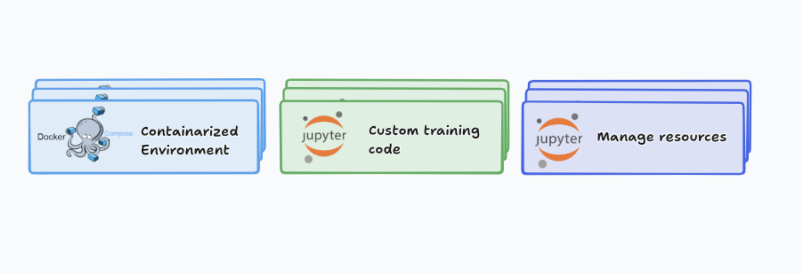
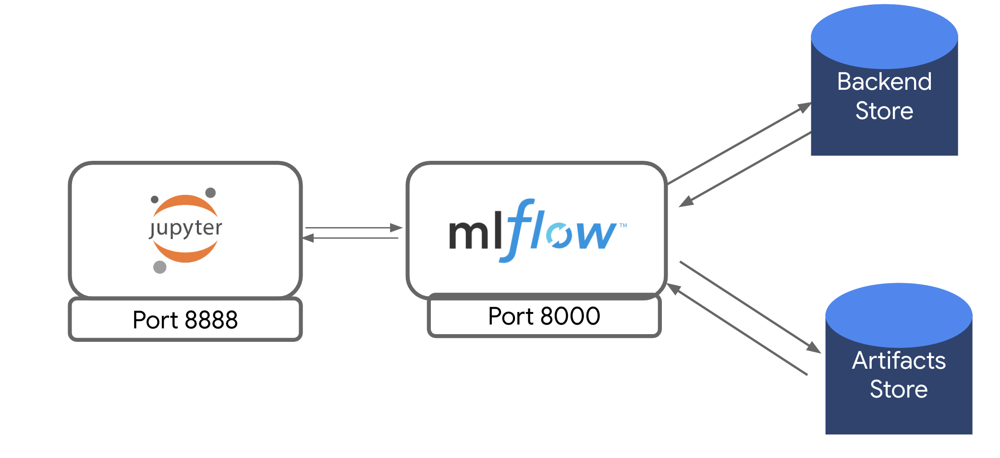
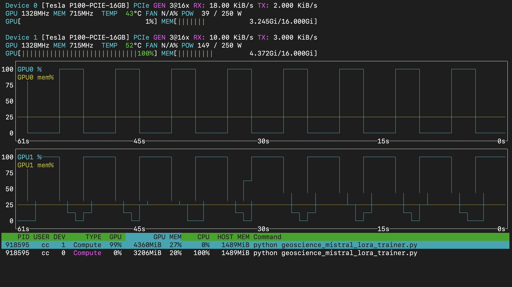
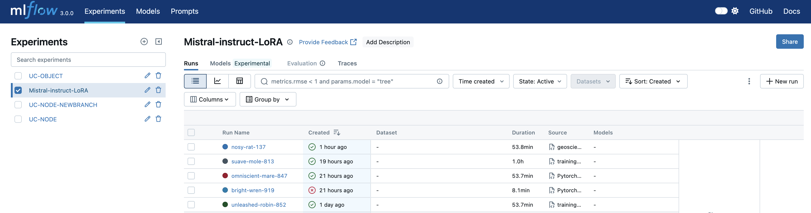
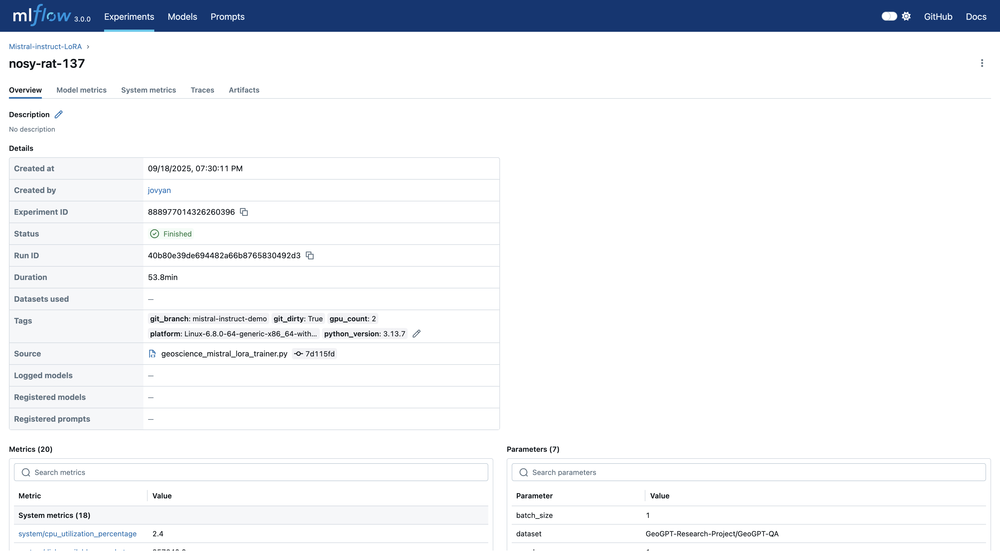
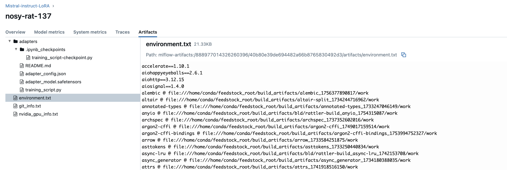
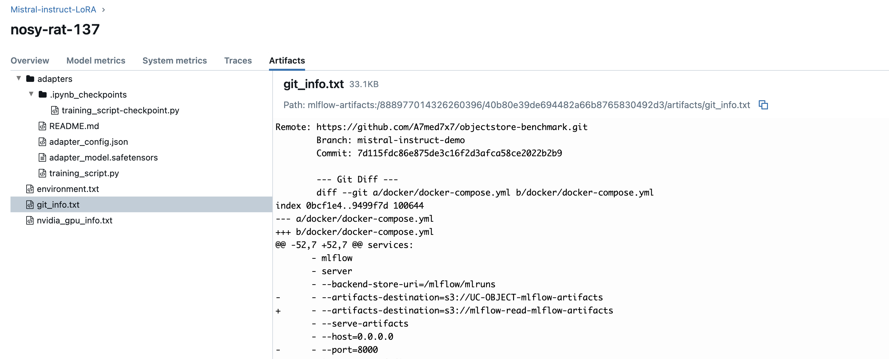
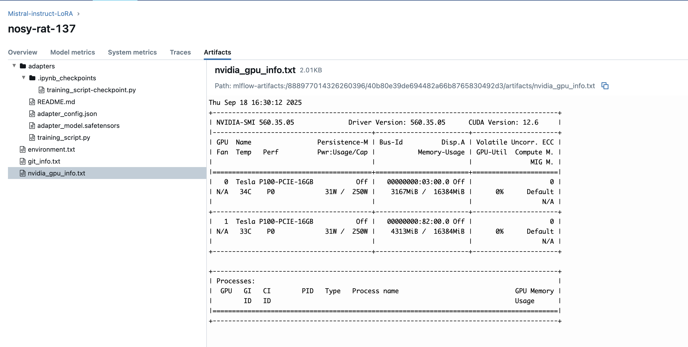

# Geoscience-LLM-trainer
In this tutorial, we will explore how to use the [ReproGen](https://github.com/A7med7x7/ReproGen) tool to generate a reproducible project workflow and inspect the infrastructure and platform design for large-model training. 
### Prerequisites
To run this experiment, you need the following:
1. An account on [Chameleon Cloud](https://chameleoncloud.org).
2. Configured SSH key added to the Chameleon Cloud sites.(see [create keys](https://teaching-on-testbeds.github.io/hello-chameleon/#:~:text=Exercise%3A%20Create%20SSH%20keys) exercise on Hello Chameleon)

## Experiment resources

For this experiment, we will provision one bare-metal node with 2 GPUs.
We’ll proceed with the `gpu_p100` NVIDIA node at CHI@TACC (Texas Advanced Computing Center where most GPU bare metal nodes live). 

>[!NOTE]
>
>feel free to create a lease first and then generate a project using ReproGen, or generate the project first and create the lease later(Ideally before fetching it), just use the same project name when creating the lease.

## Create a lease
To use resources on the Chameleon testbed, reserve them by creating a lease. Using the Horizon OpenStack web interface, create a lease for a p100 node.

- from the [Chameleon website](https://chameleoncloud.org)
- click “Experiment” > “CHI@TACC”
- log in if prompted to do so
- check the project drop-down menu near the top left (which shows e.g. “CHI-XXXXXX”), and make sure the correct project is selected.

Then,

- On the left side, click on `Reservations` > `Leases`, and then click on `Create Lease`:
    - set the `Name` of the lease to the project_name you provided when generating the project (we will use `mistral-instruct`).
    - set the start date and length. 3–10 hours is typically sufficient for this experiment.
    - Click Next.
- On the “Hosts” tab,
    - check the `Reserve hosts` box
    - leave the Minimum number of hosts and Maximum number of hosts at 1
    - in `Resource properties`, select the node type `gpu_p100`.
    - add a filter `gpu.gpu_count` and set it to `2`.
- Click “Next”. Then, click “Create”. (We won’t include any network resources in this lease. We will configure our network programmatically through the generated project notebooks.)

>[!IMPORTANT]
>
>The project name we select will be used as a prefix for naming the server and our Object Store Container, and it will shape the commands we use throughout the experiment. Therefore, if you pick a different
>name, you may need to select the commands carefully here. 

## Generating a project 

We will use ReproGen to generate a project. ReproGen provides three main benefits:
1. **Managing resources**: automates cloud setup (object store containers, credentials, servers). The generated notebooks in the `chi` directory handle these steps programmatically.
2. **Reproducible workflows**: provides a portable Dockerized environment tailored to your inputs and an MLflow server to log metrics and artifacts that will later ensure reproducibility.
3. **Custom training code**: generates Python scripts and notebooks in `notebooks` and `src` that serve as templates you can adapt.


>[!NOTE]
>
>ReproGen makes the cloud infrastructure **easy** for you, so inthe  best cases, you won't have to write or modify the Docker-Compose file, your images, or worry about how to set up the servers. The generated project handles this for you by hiding the complexity involved when setting up the environment, and lets you spin your virtual machine very quickly

To generate a project, run the following command on Chameleon JupyterHub: 

```sh
pip install copier
```

### Getting Started
Create a new project with

```sh
copier copy --vcs-ref main https://github.com/A7med7x7/reprogen.git misrtal-instruct 
```

Below are the answers to the copier prompts:

Choose configuration mode: `Advanced`
Project name: `mistral-instruct`
Git repository URL: (optional) Create a public GitHub repository to host the generated project or add it later manually in the notebook. 
Select site for compute resources: **CHI@TACC** (we use bare metal here)
Location for S3 data buckets: **CHI@UC** (you can choose another)
GPU type for the lease: `nvidia`
Primary ML framework: `pytorch`
CUDA version for Jupyter image: `cuda11-latest` 
Server configuration mode: `notebook` (we  can pick either a notebook or SSH into our machine and configure the server)
Enable Hugging Face integration? `Yes` (we pre-install HF packages and manage HF configuration)

---
## set up the environment 
Now in the generated project, follow its README.md to create buckets, configure the server, and set up the environment in the `chi` directory.
When running `2_configure_server.ipynb`, grab an access token from Hugging Face with read access (see https://huggingface.co/docs/hub/security-tokens) and paste it when prompted.

### Accessing the Jupyter container
After you start the Dockerized `jupyter` and `mlflow` containers, open them in the browser (one tab for Jupyter Lab and one for the MLflow server) to inspect the setup.

### Understanding our setup and tools
We have:
- **MLflow server**
- **Object store containers**

When running experiments, we generate artifacts that are crucial for reproducing results. The MLflow tracking server is set up (port 8000) and bound to the host so you can view metrics and artifacts via its web UI.

The MLflow client in the notebook sends HTTP requests to the server to log metrics and artifacts (examples: model checkpoints, parameters, configuration settings, datasets). 


These data are stored in two object-store containers (S3-compatible). See notebook `0_create_buckets.ipynb`.
1. **Backend store**: where structured metrics and parameters are stored (mounted at `/mnt/metrics`).
2. **Artifacts store**: where unstructured artifacts (model checkpoints, pickled models, files) are stored. The MLflow server accesses this bucket directly (not mounted), it inject your Chameleon credentials into the container runtime so MLflow can access the object store.
These elements are what makes our MLflow tracking server setup; it is suitable for team use as well as personal use.
You can view the Docker Compose configuration at `docker/docker-compose.yml`.

We track experiments by name; each MLflow run is recorded under the an experiment so you can compare runs and extract insights. in the generated code snippets under `notebooks` and `src` directories you will find examples like: 
```python
mlflow.set_experiment("project_name")  # replaced with your project name
```
This defines an experiment. Then you can start runs under:
```python
with mlflow.start_run(log_system_metrics=True) as run:
```
Passing `log_system_metrics=True` enables logging a collection of system metrics (disk, memory, and power usage).
You will also find helper functions like:
```python
log_git()
log_gpu()
```
They are imported from:
```python
from utils.mlflow_log import log_git, log_gpu
```

We wrote these utility scripts to capture additional details beyond MLflow's native features. here is what each function does:

##### `log_git()` — Captures Code Versioning  
Uses Git commands (via subprocess) to log:  
- Current branch name  
- Commit hash  
- Repository status (clean or dirty)
- `git diff` output  

**Example Output:**  
```nginx
commit: a7c3e9d
branch: main
status: dirty (1 file modified)

        --- Git Diff ---
        diff --git a/docker/docker-compose.yml b/docker/docker-compose.yml
        index 0bcf1e4..9499f7d 100644
        --- a/docker/docker-compose.yml
        +++ b/docker/docker-compose.yml
        @@ -52,7 +52,7 @@ services:
       - mlflow
       - server
       - --backend-store-uri=/mlflow/mlruns 
```

##### `log_python()` — Tracks the Python environment

- Platform and Python version information
- Exports a full `pip freeze` list to a .txt file
- Saves that file as an MLflow artifact to guarantee exact package-version reproducibility
Example output (pip freeze):
```text
numpy==1.26.4
pandas==2.2.1
scikit-learn==1.4.2
torch==2.2.0
```
>[!NOTE]
>
>In most cases you won't need this function because the [auto-log feature](https://mlflow.org/docs/latest/ml/tracking/autolog/) is supported in multiple frameworks provide simillar functionality. use it when your framework does not
support autologging — see [supported libraries](https://mlflow.org/docs/latest/ml/tracking/autolog/#supported-libraries)

##### `log_gpu()` — Records GPU information

- Detects available GPU devices
- Collects details using NVIDIA’s pynvml or AMD’s ROCm tools
- Logs:
 
  - GPU name
  - Driver version
  - CUDA/ROCm version
  - gpu-smi output for inspection

These utilities ensure that each run can be traced back with:

- The exact code version
- The full Python environment
- The hardware details used/GPU utilization

---
#### Using MLflow
If you have a configuration dictionary set for you experiment (e.g parameters like the `learning-rate`, `random-seed`... )you can use:
```python
mlflow.log_params(config) # where config is your parameters dictionary 
```

when logging multiple metrics, you add specifiy:
```python
mlflow.log_metrics({
    "epoch_time": epoch_time,
    "train_loss": train_loss,
    "train_accuracy": train_acc,
    "val_loss": val_loss,
    "val_accuracy": val_acc,
    "trainable_params": trainable_params,
}, step=epoch)
```

To log a model with MLflow (for PyTorch): 
```python
mlflow.pytorch.log_model(model, name="model")
```

#### Hugging Face integration 🤗

When enabling Hugging Face integration, the environment installs HF dependencies (see `docker/requirements`) and generates the following environment variables:

- `HF_TOKEN`: your access token (provided by you)
- `HF_TOKEN_PATH`: ephemeral path where the token is stored (to avoid leakage)
- `HF_HOME`: cache directory for downloads from HuggingFace Hub, mounted to your `data` bucket inside the container so downloads persist. 

>[!NOTE] following the material on the generated README.md and the notebooks on `chi` directory you know about the `data` bucket we use and how it maps into the folder `/mnt/data` in your local machine, this is again bind mounted with the Jupyter container to make in the directory `/home/jovyan/data`. don't let this confuses you. 


## Run and track a Pytorch experiment
in this demo we will demonstrate how this infrastructure helps train large models. we will fine-tune a large language model on Geoscience dataset, which is computationally expensive task. using our MLflow tracking server to track the experiment.

**after this section you be able to:**


* **type of artifacts to log** understand what type of artifacts, parameters, and metrics may be logged to an experiment tracking service (MLFlow or otherwise). 
* **system metrics** configure system metrics logging in MLFlow
* **Monitor GPU usage** during training with the `nvtop` utility.
* **Use the MLflow UI** to explore detailed run information, including system metrics, environment details, and model adapters.

### Finetuning a model 

in the training life cycle of Large Language Models we have the following Phases
1. **Pre-Training** :the goal of pre-training is the teach the model general language understanding where the model is trained on massive dataset,maybe the internet, Wikipedia website or books, this will result in a base model that has a **general understanding** of the language (they know a little bit about everything at this stage but they may not provide us with information with more specific questions/fields)
2. **Fine-tune/instruct**: the goal here is to make the model useful for specific tasks and improving its ability to follow instructions, we fine tune the model on a dataset that contain the instructions and the desired outputs
>[!NOTE]
>
>We can take this further by adding one more phase: **Safety** to our life-cycle of LLM-finetuning where we make the model outputs safe and ethical, but for domestication we will stick to the basic life cycle

we will instruct [Mistral-7B-OpenOrca](https://huggingface.co/Open-Orca/Mistral-7B-OpenOrca) an open source LLM with 7 billion parameters that is pre-trained and fine-tuned to outperform the original **Mistral-7B** in reasoning and instruction following tasks. 
we will use [GeoGPT-QA Dataset](https://huggingface.co/datasets/GeoGPT-Research-Project/GeoGPT-QA) which is a large-scale, synthetically generated collection of 40,400 question-answer pairs. it was created to help fine-tune models on geoscience, we will instruct our Large Language Model with this dataset so it can help us in the future answering questions about geoscience. 

#### Training techniques 
we will not be retraining a model from scratch, that would take unbelievable amount of time, fine-tuning is about adaptation, it builds on all the knowledge the model already has to specializes it, the benefits? we will have a complete custom solution that speak our specific language (geoscience in our case), so we achieve way higher accuracy in these tasks.

one of the techniques we will use in our fine-tuning is **LoRA**, its a Parameter-Efficient Fine-Tuning (PEFT) method stand for **Lower Rank Adaptation**  and the difference is: **Full fine-tuning** adjusts/trains all parameters in a large language model (LLM) and of course this requires massive computational resources, data, storage and time, while **Parameter-Efficient Fine-Tuning (PEFT)** methods update a small subset of parameters maybe 1% or add new small layers, drastically reducing costs and memory needs while preserving the base model's knowledge.

| Metric            | Fine-Tuning              | PEFT (LoRA)              |
|-------------------|--------------------------|--------------------------|
| Training Time     | ~8 hours                 | ~2 hours                 |
| GPU Memory Usage  | ~16 GB                   | ~6 GB                    |
| Validation Accuracy | 93%                     | 91%                      |
| Deployment Size   | Full model (1.2 GB)      | Adapter weights (50 MB)  |


This approach allows tasks that previously took days to be completed in hours, and you can run it on a machine with just 16 GB of RAM, rather than needing a costly one say a 100 GB.

## Run the experiment 
Inside our Jupyter server we’ll grab the training script for fine-tuning the model and run it.

```sh
cd ~/work/mistral-insrtuct/src 
wget https://github.com/A7med7x7/ReproGen/blob/3e6290f4904b5ee170afb3c483d2d0c0819d95e2/src/Pytorch_manual_log_example.py 
```
open a terminal shell from `file-> new launcher -> terminal` then run the command:

```sh
python geoscience_mistral_lora_trainer.py 
```

At this point, you’ll notice the code raised an error that some a dependency is missing.  
This is part of the process we practice adding dependencies to the runtime.
most of the time you want your software dependencies (any 3rd-party library) inside your `docker\requirements.txt` so they’re installed automatically when running Docker Compose.

SSH into your machine, from your home directory and stop the containers:
```sh
docker compose --env-file .env -f mistral-instruct/docker/docker-compose.yml down
```
>[!NOTE]
>
>if the command to stop the container didn't work, the generated command for you is provided in your generated `README.md` at your project repo root.

and lets add the missing dependencies (sentencepiece) in the `docker/requirements.txt` using
```sh
echo "sentencepiece" >> requirements.txt
```
or 

```sh
nano mistral-instruct/docker/requirements
```

paste the library name `sentencepiece` and save the file using `command/ctrl` + `O` and exit with `command/ctrl` + `X`
run the containers again 
```sh
docker compose --env-file .env -f mistral-instruct/docker/docker-compose.yml up -d --build
```
Now you can access the web interface for both containers.

 before running the script 
>[!NOTE]
>
>the original dataset have around 40,400 samples, for demonstration, our experiment will use only 1% (414 samples) and 1 epoch, so we don't wait for a long amount of time to see complete the process. you can simply use the portion you want from the dataset by manipulating the variables `train_subset_pct` in the training script. and `epochs` under the parse_args() function. 

---

### Baseline Model (Before Fine-tuning)

before fine-tuning, we’ll run a notebook to check how the **base model** answers geoscience questions
```vb
cd work/mistral-instruct/notebooks
wget https://raw.githubusercontent.com/A7med7x7/ReproGen/training-demo/notebooks/1_baseline_model.ipynb 
```
Run the cells, and you’ll see the model gives answers that _sound reasonable_ but aren’t very accurate.

For example, a dataset answer might look like:

```txt 
In the Kuala Terengganu coastal zone, the Delphi and Analytical Hierarchy Process (D-AHP) Hybrid model and Geographic Information System (GIS) technique are used for Coastal Land-Use Assessment (CLUA). These methods help detect the most suitable and unsuitable areas for urban development. The information gathered not only provides insights into the current urban land-use trends and established amenity status in Kuala Terengganu but also supports the potential establishment of urban facilities for improved urban planning and appropriate decision-making. This approach is practical for government, policymakers, and planners to strategize and plan for the future of coastal cities in Malaysia and other similar coastal cities worldwide.
```

in my case the model answered
```txt 
In the Kuala Terengganu coastal zone, land-use suitability assessment is conducted using various methods and tools, such as Geographic Information Systems (GIS), Remote Sensing (RS), and Land-Use/Cover Change (LUCC) modeling. These tools help in analyzing and visualizing the spatial distribution of land uses, identifying potential conflicts, and evaluating the environmental impacts of different land-use options.

1. Geographic Information Systems (GIS): GIS is a powerful tool that integrates, analyzes, and displays geographic data. It allows users to create maps, perform spatial analyses, and generate reports to support decision-making. In the Kuala Terengganu coastal zone, GIS is used to create digital maps of land-use patterns, elevation, soil types, and other relevant data layers. These layers can then be combined and analyzed to determine the most suitable land uses for a specific
```
so the models knows something about Geoscience but the information isn't accurate if we were to ask it a question that is new it might hallucinate and provide us with unrelated answers. 

--- 
### Fine-tuning the Model

now lets fine tune our model, run the command: 
```vb
python geoscience_mistral_lora_trainer.py 
```

>[!TIP]
>
>during the experiemnt running you can use a utility we installed earlier when configuring 
>our server its called `nvtop` it help us monitor the GPU usage via the CLI In a terminal. 
>on the  host (not inside the container), run 
>```
>nvtop
>```
> 
> The display is broken down into three main sections: 
>1. **GPU Header Information:** The top two blocks provide static and real-time data for each GPU.
>2. **Real-Time Usage Graphs:** The middle section shows a historical view of GPU and memory utilization.
>3. **Process List:** The bottom table details which processes are using the GPUs and their resource consumption.

This script applies **LoRA fine-tuning** on the selected subset of the dataset.  
During training, logs and metrics are automatically tracked in **MLflow**.
in the our fine-tuning script we set experiment with the name

```python
mlflow.set_experiment("Mistral-instruct-LoRA")
```
and we set `log_system_metrics=True` 
activate the auto logging for PyTorch using 
```python
mlflow.pytorch.autolog(log_models=False)
```
>[!NOTE]
>
>we set log_models to False because we are not interested in logging the model now and it will take a lot time and disk space to log 7 billion parameter model, or even break the code. 

we use our utility functions 
```python 
with mlflow.start_run(log_system_metrics=True):

	log_git()
	log_gpu()
	log_python()
```
and log parameters we are interested in manually 
 
```python 
mlflow.log_params({
	"model_name": args.model_name,
	"dataset": args.dataset_name,
	"batch_size": args.per_device_train_batch_size,
	"grad_accum": args.gradient_accumulation_steps,
	"seq_len": args.max_seq_length,
	"epochs": args.epochs,
	"max_memory": max_memory,

})
```
and most importantly we save and log our adapter 
```python 
mlflow.log_artifacts(str(adapter_dir), artifact_path="adapters")
```
simply think of adapter as small, plug-and-play neural network modules inserted into a pre-trained model's layers during fine-tuning to adapt it to new tasks or domains without retraining the entire model. 
after the training finish with the logs 
```nb 
🦎 Saving final LoRA adapter to /home/jovyan/data/adapters/adapter_final
🦎 Training complete. Adapter saved to: /home/jovyan/data/adapters/adapter_final
🏃 View run nosy-rat-137 at: http://mlflow:8000/#/experiments/888977014326260396/runs/40b80e39de694482a66b8765830492d3
🧪 View experiment at: http://mlflow:8000/#/experiments/888977014326260396
2025/09/18 17:23:58 INFO mlflow.system_metrics.system_metrics_monitor: Stopping system metrics monitoring...
2025/09/18 17:23:58 INFO mlflow.system_metrics.system_metrics_monitor: Successfully terminated system metrics monitoring!
```
You can open the MLflow UI to:
- Monitor training progress (loss curves, metrics).
- Track experiments and runs.
You can open the MLflow UI to:
- Monitor training progress (loss curves, metrics).
- Track experiments and runs.
in the MLflow UI look for the experiment name in the left side panel (Mistral-insrtuct-LoRa in our case), when selected you will see runs under that name, the names of the runs are randomly generated


### MLflow UI 
in the details section you can see the basic information about the run 
if you move to the artifacts window you will see the following 

![[Screenshot 2025-09-18 at 8.34.49 PM.png]]

1. **Adapter directory** : this is where we saved our model adapter, the checkpoint and training script
	
2. **environment.txt** : is where we capture the dependencies in our environment and log it as a txt you can explore it. 
	
3. **git_info.txt**: it includes information about the code tracking like the `remote repository link`, the `branch` in which code was run and the commit hash alongside the `git_diff` command output 
	
4. **nvidia_gpu_info.txt**: include the gpu utilization information from the command `nvidia-smi`  in my case: 
	
### Test Fine-tuned model
finally Once fine-tuned, we will test the model by plugging the adapters and and compare how the new model answers the _same question_ more precisely. 

```vb
cd work/mistral-instruct/notebooks
wget https://raw.githubusercontent.com/A7med7x7/ReproGen/training-demo/notebooks/2_finetuned_model.ipynb 
```
follow the notebook `2_finetuned_model.ipynb` 

###  Wrapping Up
At this stage, you have:
- Generated a project using ReproGen
- Explored the infrastructure needed for large training 
- Fine-tuned a **Mistral model with LoRA adapters**.
- Logged metrics, system info, and artifacts in **MLflow**, making your runs reproducible and easy to compare.
- Tested your **fine-tuned model** against the base model to see the improvements in responses.

you can play with: 
1. **Compare Results:** Use the MLflow UI to visualize how the fine-tuned model performs cs, artifacts.
2. **Iterate:** Adjust hyperparameters like `learning_rate`, `epochs`, or `grad_accumulation_steps` and re-run to see if you can improve performance further.
