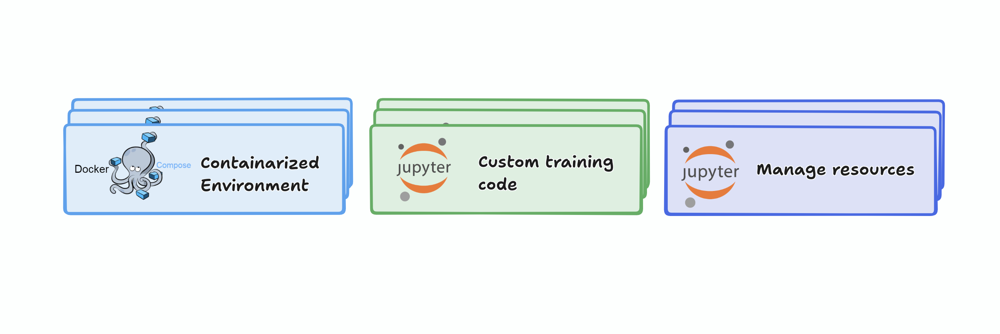

# experiment
In this tutorial, we will explore how to use the ReproGen tool to generate a reproducible project workflow and inspect the infrastructure and platform design for large-model training. 
### Prerequisites
To run this experiment you need the following:
1. An account on Chameleon Cloud (https://chameleoncloud.org).
2. Your SSH key added to the Chameleon Cloud site(s).

### Experiment resources

For this experiment, we will provision one bare-metal node with 2 GPUs.
We’ll proceed with the `gpu_p100` NVIDIA node at CHI@TACC. 

>[!NOTE] You can create a lease first and then generate a project using ReproGen, or generate the project first and create the lease later — just use the same project name when creating the lease.

### Create a lease
To use resources on the Chameleon testbed, reserve them by creating a lease. Using the Horizon OpenStack web interface, create a lease for a p100 node.

- from the [Chameleon website](https://chameleoncloud.org/hardware/)
- click “Experiment” > “CHI@TACC”
- log in if prompted to do so
- check the project drop-down menu near the top left (which shows e.g. “CHI-XXXXXX”), and make sure the correct project is selected.

Then,

- On the left side, click on `Reservations` > `Leases`, and then click on `Create Lease`:
    - set the `Name` of the lease to the project_name you provided when generating the project (we used `mistral-instruct`).
    - set the start date and length. 3–10 hours is typically sufficient for this experiment.
    - Click Next.
- On the “Hosts” tab,
    - check the `Reserve hosts` box
    - leave the Minimum number of hosts and Maximum number of hosts at 1
    - in `Resource properties`, select the node type `gpu_p100`.
    - add a filter `gpu.gpu_count` and set it to `2`.
- Click “Next”. Then, click “Create”. (We won’t include any network resources in this lease. We will configure our network programmatically through the generated project notebooks.)


## Generating a project 

we will use ReproGen to generate a project. ReproGen provides three main benefits:
1. **Managing resources**: automates cloud setup (object store containers, credentials, servers). The generated notebooks in the `chi` directory handle these steps.
2. **Reproducible workflows**: provides a dockerized environment tailored to your inputs and an MLflow server to log metrics and artifacts.
3. **Custom training code**: generates Python scripts and notebooks in `notebooks` and `src` that serve as templates you can adapt.


To generate a project, run the following command on Chameleon JupyterHub: 

```sh
pip install copier
```

### Getting Started
Create a new project with

```sh
copier copy --vcs-ref main https://github.com/A7med7x7/reprogen.git llm-finetune 
```
  
Below are example answers to the copier prompts:

➜ copier copy --vcs-ref main https://github.com/A7med7x7/reprogen.git home

Choose configuration mode: `Advanced`
Project name: `mistral-instruct`
Git repository URL: (optional) create a public GitHub repository to host the generated project if you want it cloned on the node.
Select site for compute resources: **CHI@TACC** (we use bare metal here)
Location for S3 data buckets: **CHI@UC** (you can choose another)
GPU type for the lease: `nvidia`
Primary ML framework: `pytorch`
CUDA version for Jupyter image: `cuda11-latest` (or choose newer like `cuda-12`)
Server configuration mode: `notebook` (options include `.env` generation, docker-compose, etc.)
Enable Hugging Face integration? `Yes` (we pre-install HF packages and manage HF configuration)

---
## set up the environment 
Now in the generated project, follow its README to create buckets, configure the server, and set up the environment in the `chi` directory.
When running `2_configure_server.ipynb`, grab an access token from Hugging Face with read access (see https://huggingface.co/docs/hub/security-tokens) and paste it when prompted.

### Accessing the Jupyter container
After you start the dockerized `jupyter` and `mlflow` containers, open them in the browser (one tab for Jupyter Lab and one for the MLflow server) to inspect the setup.

### Understanding our setup and tools
We have:
- **MLflow server**
- **Object store containers**

When running experiments we generate artifacts that are crucial for reproducing results. The MLflow tracking server is set up (port 8000) and bound to the host so you can view metrics and artifacts via its web UI.

The MLflow client in the notebook sends HTTP requests to the server to log metrics and artifacts (examples: model checkpoints, parameters, configuration settings, datasets). 

![[Screenshot 2025-09-18 at 9.02.45 AM.png]]
These data are stored in two object-store containers (S3-compatible). See notebook `0_create_buckets.ipynb`.
1. **Backend store**: where structured metrics and parameters are stored (mounted at `/mnt/metrics`).
2. **Artifacts store**: where unstructured artifacts (model checkpoints, pickled models, files) are stored. The MLflow server accesses this bucket directly (not mounted), so inject your Chameleon credentials into the container runtime so MLflow can access the object store.
These elements are what makes our MLflow tracking server setup; it is suitable for team use as well as personal use.
You can view the Docker Compose configuration at `docker/docker-compose.yml`.

We track experiments by name; each MLflow run is recorded under the experiment so you can compare runs and extract insights. In the generated code snippets under `notebooks` and `src` you will find examples like: 
```python
mlflow.set_experiment("project_name")  # replaced with your project name
```
This defines an experiment. Then you can start runs with:
```python
with mlflow.start_run(log_system_metrics=True) as run:
```
Passing `log_system_metrics=True` enables collection of system metrics (disk, memory, and power usage).
You will also find helper functions like:
```python
log_git()
log_gpu()
```
They are imported from:
```python
from utils.mlflow_log import log_git, log_gpu
```

We wrote utility scripts to capture additional details beyond MLflow's native features. Here is what each function does:

##### `log_git()` — Captures Code Versioning  
Uses Git commands (via subprocess) to log:  
- Current branch name  
- Commit hash  
- Repository status (clean or dirty)  

**Example Output:**  
```nginx
commit: a7c3e9d
branch: main
status: dirty (1 file modified)
# and git diff output 
```

##### `log_python()` — Tracks the Python environment

- Platform and Python version information
- Exports a full `pip freeze` list to a .txt file
- Saves that file as an MLflow artifact to guarantee exact package-version reproducibility
Example output (pip freeze):
```text
numpy==1.26.4
pandas==2.2.1
scikit-learn==1.4.2
torch==2.2.0
```
[!NOTE] In most cases you won't need this function because many frameworks provide autolog features. Use it when your framework does not support autologging — see supported libraries: https://mlflow.org/docs/latest/ml/tracking/autolog/#supported-libraries
##### `log_gpu()` — Records GPU information

- Detects available GPU devices
- Collects details using NVIDIA’s pynvml or AMD’s ROCm tools
- Logs:
 
  - GPU name
  - Driver version
  - CUDA/ROCm version
  - gpu-type-smi output for deeper inspection

These utilities ensure that each run can be traced back with:

- The exact code version
- The full Python environment
- The hardware details used

---
#### Using MLflow functions
If you have a configuration dictionary you can use:
```python
mlflow.log_params(config)
```
To log multiple metrics:
```python
mlflow.log_metrics({
    "epoch_time": epoch_time,
    "train_loss": train_loss,
    "train_accuracy": train_acc,
    "val_loss": val_loss,
    "val_accuracy": val_acc,
    "trainable_params": trainable_params,
}, step=epoch)
```
To log a model with MLflow (for PyTorch):
```python
mlflow.pytorch.log_model(model, name="model")
```

#### Hugging Face integration 🤗

When enabling Hugging Face integration, the environment installs HF dependencies (see `docker/requirements`) and generates these environment variables:

- `HF_TOKEN`: your access token (provided by you)
- `HF_TOKEN_PATH`: ephemeral path where the token is stored (to avoid leakage)
- `HF_HOME`: cache directory for downloads from HuggingFace Hub, mounted to your data bucket so downloads persist

## Run and track an experiment
In this demo we demonstrate how this infrastructure helps train large models. We will fine-tune a large language model, which is computationally expensive.


